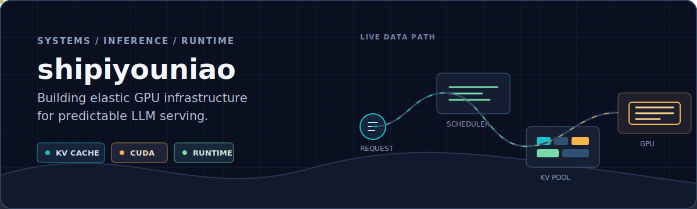

  

<h1 align="center">石皮幼鸟 · shipiyouniao</h1>

  AI infrastructure engineer on Sangfor's Managed Cloud Platform team, 
  building predictable LLM serving, elastic GPU memory, and runtime protocols.

  

I work where inference engines, GPU runtimes, and cloud-native control planes meet.
My current focus is making shared accelerators behave like dependable infrastructure:
correct under pressure, observable in production, and fast on real workloads.

### Current work

- **LLM serving:** vLLM and SGLang integration, long-context inference, PD multiplexing,
  CUDA execution paths, and correctness-first performance analysis.
- **Elastic GPU memory:** KV cache pooling, CUDA VMM, quota and reclamation policy,
  multi-instance isolation, MPS, and shared model weights.
- **Runtime protocols:** building [NNRP](https://github.com/NagareWorks) across Rust,
  Python, and C# with deterministic transports and explicit lifecycle semantics.
- **Cloud native:** Kubernetes-oriented placement, observability, recovery, and
  platform integration for production inference systems.

### Selected work

| Area | Project | What I work on |
| --- | --- | --- |
| Runtime protocol | [NagareWorks/nnrp-rs](https://github.com/NagareWorks/nnrp-rs) | Native transport and lifecycle runtime |
| SDK | [NagareWorks/nnrp-py](https://github.com/NagareWorks/nnrp-py) | Python runtime bindings and release engineering |
| SDK | [NagareWorks/nnrp-cs](https://github.com/NagareWorks/nnrp-cs) | C# protocol SDK and native transport integration |
| Unity tooling | [UnityEasyInject](https://github.com/shipiyouniao/UnityEasyInject) | Lightweight dependency injection for Unity |

### Toolbox

  
  
  
  
  
  
  

> Measure the real path. Preserve the invariants. Optimize what remains.
