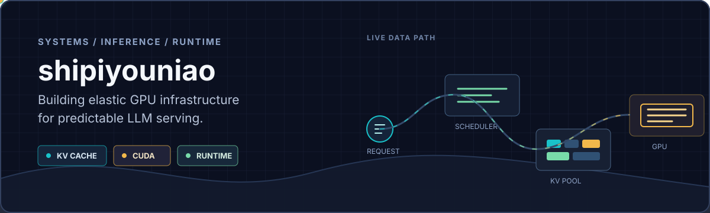

  

<h1 align="center">石皮幼鸟 · shipiyouniao</h1>

  Full-stack engineer at Sangfor Technologies, currently focused on AI infrastructure. 
  One of the maintainers of <a href="https://github.com/ovg-project/kvcached">KVCached</a>, with a focus on LLM inference and GPU memory management.

I build frontend and backend applications, and particularly enjoy working with C#.
I also like making games, both in Unity and for the browser.

My current work spans inference systems, from KV cache allocation and GPU memory mapping to
engine integration and production observability. I contribute to vLLM and SGLang
alongside my work on KVCached.

I spend much of my time tracing failures, building reproducers,
and comparing behavior and performance on hardware.

### Current work

- **GPU memory:** elastic KV allocation, prefix-cache correctness,
  transactional mapping, and safe memory reclamation across workers.
- **Engine compatibility:** adapting to vLLM and SGLang releases, model cache
  layouts, and changes to scheduling and execution paths.
- **Observability:** allocator snapshots, serving metrics, and diagnostics for
  memory pressure and allocation failures.
- **Validation and automation:** hardware-backed regression tests, fault injection,
  reproducible benchmarks, and automated compatibility checks.

### Other projects

- [Minefarer](https://github.com/shipiyouniao/minefarer): a Minesweeper adventure
  with exploration, puzzles, and a story campaign.
  [Play in your browser](https://shipiyouniao.github.io/minefarer/).
- **NNRP** at [NagareWorks](https://github.com/NagareWorks): a runtime protocol
  project with [Rust](https://github.com/NagareWorks/nnrp-rs),
  [Python](https://github.com/NagareWorks/nnrp-py), and
  [C#](https://github.com/NagareWorks/nnrp-cs) implementations.
- [UnityEasyInject](https://github.com/shipiyouniao/UnityEasyInject): lightweight
  dependency injection for Unity.

### Toolbox

**Frontend**

  
  
  
  
  

**Backend and runtimes**

  
  
  
  
  

**Systems and inference**

  
  
  

**Infrastructure and monitoring**

  
  
  
  
  

**Databases and time-series storage**

  
  

**Game development**

  

### Contact

[2960474346@qq.com](mailto:2960474346@qq.com)
